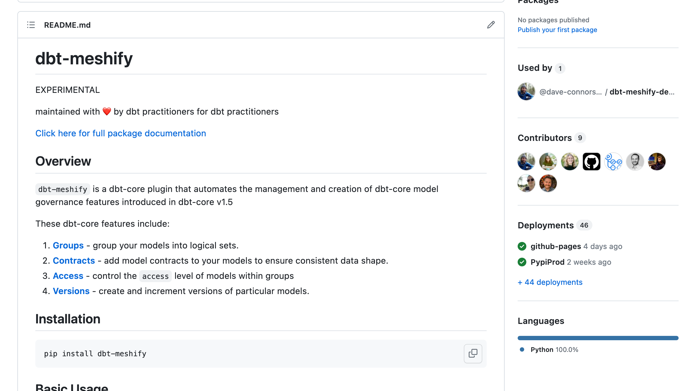

<!-- _class: lead -->

# From Overgrown to **Thriving**

Scaling Your dbt Project Like a Gardener

<div class="footer">
  <div class="logo">
  
  <span>
  MDS FEST
  </span>
  </div>

  <div class="small_title">
  From Overgrown to Thriving
  </div>

  <div></div>
</div>

---

<!-- _class: left -->

<style scoped>
    small { color: gray; font-weight: thin; margin: 0; }

    section:where(.left) {
        display: flex;
        flex-flow: column nowrap;
        justify-content: center;
    }

</style>

<h1>Nicholas Yager</h1>
<small>they/them</small>
<p>
Principal Analytics Engineer
<br />
<small style="color: #D8621D;">HubSpot</small>
</p>


<!--
I'm Nicholas Yager! I'm a Principal Analytics Engineer at HusSpot and
today I'm going to talk with you about dbt projects and gardens.
-->

---


<!--
Well... not just any type of garden. Specifically, overgrown gardens.
I LOVE overgrown gardens. They are monuments to nature's ability to
create life, and for living organism's ability to grow into nearly any
niche available to them.

The downside to overgrown gardens, is that they are impossible to for
a gardener to maintain. If we want to start planing productive crops
and beautiful flowers, we're at the mercy of the verdant life already
there. We as gardeners implement our designs within _this_ garden as it already exists.

Of course, you're not here to discuss horticulture per se. This is a
data conference, after all. So, bring dbt DAGs into this.
 -->

<!-- _footer: ''  -->

---


<!--
I'm reasonably confident that you all are familiar with this type of image. A tangled web of references that is nearly inscrutable at first glance, and that's if you're willing to wait for the dbt docs render.

Now, marketing images and trivial guides always have dbt projects with are
neat, tidy DAGs that are easy to view on one screen. But, this is not the reality for most dbt users! Organizations in the real world have more than
perfect representations for transactions and customers. Business processes
can be really complex, and this necessitates that your dbt projects be complex
enough to encapsulate these processes as core entities.

Having that been said, there is a fine line between a project being complex, and being messy. In my opinion, complexity is a byproduct of constraints -- you must work with the data you have, and sometimes this requires extra layers of abstraction and processing. Messiness and clutter, however, happen as an issue of scale.

Quite simply
 -->

<!-- _footer: ''  -->

---

<!-- _class: lead -->

# dbt projects are tricky to scale

<div class="footer">
  <div class="logo">
  
  <span>
  MDS FEST
  </span>
  </div>

  <div class="small_title">
  From Overgrown to Thriving
  </div>

  <div></div>
</div>

---

# dbt projects are tricky to scale

<div class="footer">
  <div class="logo">
  
  <span>
  MDS FEST
  </span>
  </div>

  <div class="small_title">
  From Overgrown to Thriving
  </div>

  <div></div>
</div>

---

# dbt projects are tricky to scale

1. Large organizations trend towards decentralization as they grow

<div class="footer">
  <div class="logo">
  
  <span>
  MDS FEST
  </span>
  </div>

  <div class="small_title">
  From Overgrown to Thriving
  </div>

  <div></div>
</div>

<!-- As organizations grow, they trend towards decentralization. It's very easy to keep all of your analytics talent aligned and in one central org while you have 5, 10, heck 20 people, but at a certain point, it is not longer effective to have once central block of AE talent. Many organizations follow a two-pizza rule -- the idea that effective teams are usually those fed by two pizzas -- and as such will decompose teams into specific domains. This decentralization then opens the door to drift.   -->

---

# dbt projects are tricky to scale

1. Large organizations trend towards decentralization as they grow
2. Decentralization can lead to inconsistent standards and significant overhead

<div class="footer">
  <div class="logo">
  
  <span>
  MDS FEST
  </span>
  </div>

  <div class="small_title">
  From Overgrown to Thriving
  </div>

  <div></div>
</div>

<!--
Once you're in territory where there are multiple distinct teams operating independently, it's common for there to be drift in how the teams operate. This can be something as trivial as leading commas vs trailing commas. It can also ne something as important as the definition of a Customer. Perhaps Sales analytics defines a customer as a CRM account with subscription, whereas a finance analytics team may define a customer as a corporate entity. This definition mismatch means that these two analytics teams now have entirely incompatible customer reporting. This adds to overhead and makes it difficult for these teams to collaborate.
-->

---

# dbt projects are tricky to scale

1. Large organizations trend towards decentralization as they grow
2. Decentralization can lead to inconsistent standards and significant overhead
3. It's so easy to add "just one more" model

<div class="footer">
  <div class="logo">
  
  <span>
  MDS FEST
  </span>
  </div>

  <div class="small_title">
  From Overgrown to Thriving
  </div>

  <div></div>
</div>

<!-- And now we're in the endgame. Do we put in the effort to have Sales analytics align with Finance or vis versa, or do we make just a few more models that shim together bits of both to workaround the reporting difference? dbt Core is a wondrous tool. makes it delightfully easy to reference existing models and start pulling in data from somewhere else in the project. This comes at a price, however, in that each new model we add to workaround our differences is one more liability for our team in the future. -->

---

<!-- _class: lead -->

# This leads to **sprawl**

<div class="footer">
  <div class="logo">
  
  <span>
  MDS FEST
  </span>
  </div>

  <div class="small_title">
  From Overgrown to Thriving
  </div>

  <div></div>
</div>

---


<!--

This leads to an overgrown garden that, while full of life, is a nightmare to reason about and to maintain.

So, if we want to make our overgrown dbt projects maintainable and ergonomic, it
stands to reason that we can work like gardeners to rehabilitate them. Thankfully, gardeners have been working on this problem for a _long_ time, and there are five reasonably accepted steps for rehabilitating an overgrown garden.
-->

<!--  -->

---

# The five steps

1. Survey your garden
2. Clear out the trash and weeds
3. Renewal pruning
4. Divide the perennials
5. Keep the weeds under control

<div class="footer">
  <div class="logo">
  
  <span>
  MDS FEST
  </span>
  </div>

  <div class="small_title">
  From Overgrown to Thriving
  </div>

  <div></div>
</div>

---

# Step One: Survey your garden

<!-- _class: lead -->

<div class="footer">
  <div class="logo">
  
  <span>
  MDS FEST
  </span>
  </div>

  <div class="small_title">
  From Overgrown to Thriving
  </div>

  <div></div>
</div>

---

# Survey your garden

1. What are your core entities?
2. What are your exposures?
3. How are your data consumers using your models?
4. Are there any obvious architectural issues?

<div class="footer">
  <div class="logo">
  
  <span>
  MDS FEST
  </span>
  </div>

  <div class="small_title">
  From Overgrown to Thriving
  </div>

  <div></div>
</div>

---

<!-- _class: lead -->

# Step Two: Clear out the weeds and trash

<div class="footer">
  <div class="logo">
  
  <span>
  MDS FEST
  </span>
  </div>

  <div class="small_title">
  From Overgrown to Thriving
  </div>

  <div></div>
</div>

<!--
1. Remove deprecated or otherwise unused models
2. Consolidate duplicate models -->

---

<!-- _footer: ''  -->


---

<!-- _class: lead -->

# Step Three: Renewal pruning

<div class="footer">
  <div class="logo">
  
  <span>
  MDS FEST
  </span>
  </div>

  <div class="small_title">
  From Overgrown to Thriving
  </div>

  <div></div>
</div>

---


<!--
Gradual removal of unproductive branches to allow a plant to spend its resources growing healthy branches.

Within the context of a dbt project, this is a matter of identifying antip-atterns and other non-productive structures in your DAG, and refactoring them to make them more ergonomic.

-->
<div class="footer">
  <div class="logo">
  
  <span>
  MDS FEST
  </span>
  </div>

  <div class="small_title">
  From Overgrown to Thriving
  </div>

  <div></div>
</div>

---

<!--

Based on my experience working as a consultant on dozens of dbt projects, there
are four main anti-patterns that tend to add unnecessary messiness to a project.

-->


<!-- https://mermaid.live/edit#pako:eNqNVE1zmzAU_Csa9dALyUjCwViHXuJjemlvAY9HgLBpQWKEaOJ4_N8rSxAwpSS68J61u-9jwWeYyoxDCvNSvqRHpjR4-hGLWABz0pI1zZbnoJGtSjnIi7KkXwKUhCTwQKOV_M2HPJWlVH06EahMkbLjI7RZJf7A7_OO79IJX_CX7yOJBAd5ggeJPu8kXDqRqFXxh2k-lsnz_MM2nEqjTyUH_JVVdcnJQDcHoekqZij4v5SErdYkudZxNEttk4Ni9fG9YPSouOndkNihEAe3zgbkUgF95J09zW5QyArFU11IYd0Eo-OwfuSee7yjlLp4DrfqcWSMu0XaZkhkF3tF2Xwi5vre26s9jhp92I8b6O1dYpExiyyw3IDg7u7btO7shDNAsti9JbihF_udxXGR3Xr9j9k42krxVYNfshC9s8CErNv07rboR07jTzpNPuv0stGu5jD6bKm5a7MY6MGKq4oVmfk_Ol-vYmhe74rHkJow4zlrSx3DWFwMlLVa_jyJFFKtWu7Bts7MJ7ItmNlm1f9YMwHpGb5Cur4Pg8BHIcGEhIisfQ-eIMUBvg_QQ-ivNgHa-OuHiwffpDR8bMnPNr5qXf4Cq_CTOw -->


<!-- https://mermaid.live/edit#pako:eNqNlEFzmzAQhf-KRj30QjIIsMA69FIf20tza8hBwComFRIjRB3X4_9emZjIcYkanbQ8fW-XJ4YDrnUDmGEh9a7ecmPRtx-lKhVyq5Z8GDYg0KBHUwMSrZTsE42rIqERGqzRv8DXtZbazOWVQeeayDMfx-usSj0_12f-pfxnBAW77xcmFaGiIt5krs8mL-WVRW_a39zCpY0Q4oODDHYvAcEz73oJicfdiuPrMBYQ8i5S8SxPqrnPBI7Vo-H99rXd_VcDbnLE0a5twMxxaoPsFlDH-75Vjw_eoGkN1LbVarpMdLEmcsUYmzYLGg1oa6fN97Ag5wG08NrSQOjm5su5x5LxG3lpMH-AhuXCy6Cak9n7sZP7jVafLTLwpFs1RX3HO0AbbvkAdnh42-o_oZNAOmkwnSRAZkGS-BdPl4zD8gWdhensKlUc4Q5Mx9vG_VkOJ7HELr4OSszctgHBR2lLXKqjO8pHq-_2qsbMmhEiPPaN-9g3LXe30WEmuBzc054rzA74GbP8tqA0jYuEJEkRJ3ka4T1mhJJbGq-KNFvTeJ3mq2OE_2jtDMgE_5z2pw7Hv7cib78-->


<!-- https://mermaid.live/edit#pako:eNqFlEFvpCAYhv8KoYe92EbUQYfDJpvMcfeye2vtAQU67CIYxG2nk_nvZRwtU2MtJz7e73k_8hI9wtowDgkUyjzXe2od-Pm71KUGftWKdt2OC9CZ3tYcCKkUucFxVSQ4Ap2z5h8PdW2UsVM5M2j8EDXycbzNqjTwUz3yl3LGa_7868qiQlhUKFhM9WhxKWcWrZX_qePXNkKIL69xcencQXHAX2jTKp4E3K84nkexgKBPkYpmeVJNcwawr54sbffv4x5-MAYa2XVSP3kfrlgHqGb-ptby2o3hekbqx2DD5FmURg8PCq7W0L8hhAybBQ2vaFuvTa-xIOcBXRoKbm-_jz5L8Ad5aXhowEHmmp27P08QPeyM_ubAXyM1cHsOGG89xHV9AEYAelU_fpz6RYhoJah0NYlkhcxWSRQySJeM1-U0yNk6nc0ChhFsuG2oZP5vcTyLJfRZNryExG8ZF7RXroSlPvlW2jvz56BrSJzteQT7lvmPbyepf5gGEkFV509bqiE5whdI8rsC4zQuEpQkRZzkaQQPkCCM7nC8KdJsi-Ntmm9OEXw1xhugAb4f9ucJpzfgQmZ6 -->


<!-- https://mermaid.live/edit#pako:eNqVVMGymyAU_RWGLrrxvRFUkrDoplm2m3bX-CaDioktgoPY99JM_r0osaaWJA0buXDOgXvvkSPMVcEhhaVQr_meaQM-fUllKoEduWBtu-YlaFWncw7KSgj6joTZEpMAtEarH3yKcyWUHsOZQG0PEWd-GK7iLJr4Y3zmu3DGl_z184VEhkiZoUlijM8SLpxJNLr6yQy_lCnL8u41nEprDoID_sbqRnA80e0Iw3kpPBR0lZKxeIGz_hxHG6hdttOs2f85cPNRc3t3S2K7Su5cOVtQKg3Mnp_b075MCv0oKs1zUyk5dPRyx-Hjjftu4xdKqZv7cMmIS27jyIgjl7gZ0iWwHRLY2huY3dYhe86weouQPEogM8Loo_m9BjSeFL31Ak9PH-YZDGuO7a2dh5Pc4RAPh3g5XBZ_G-cf56DNWsn3BnxXlRxtAippFBCcnX_LR32Dxj6j237AIw7fxkUjLvpf36BHbYD9BI8HNoM9rom6_D39Qd4CeID4TmZTn2_mcxXmKurbHswCA1hzXbOqsE_-sd9MoX1Bap5CaqcFL1knTApTebJQ1hn19SBzSI3ueAC7prCv0Lpi1mM1pCUTrV1tmIT0CN8gXTwvCYnCJUYYL0O8iAJ4gBQR9EzCZBnFKxKuokVyCuAvpawAGsjfhnl_wuk36L0CLg -->

<!--
In a dbt project, we can prune our project by refactoring any anti-patterns currently in use in the project's core entities. This would include
-->
<div class="footer">
  <div class="logo">
  
  <span>
  MDS FEST
  </span>
  </div>

  <div class="small_title">
  From Overgrown to Thriving
  </div>

  <div></div>
</div>

---


<div class="footer">
  <div class="logo">
  
  <span>
  MDS FEST
  </span>
  </div>

  <div class="small_title">
  From Overgrown to Thriving
  </div>

  <div></div>
</div>

---


<div class="footer">
  <div class="logo">
  
  <span>
  MDS FEST
  </span>
  </div>

  <div class="small_title">
  From Overgrown to Thriving
  </div>

  <div></div>
</div>

---


<div class="footer">
  <div class="logo">
  
  <span>
  MDS FEST
  </span>
  </div>

  <div class="small_title">
  From Overgrown to Thriving
  </div>

  <div></div>
</div>

---


<div class="footer">
  <div class="logo">
  
  <span>
  MDS FEST
  </span>
  </div>

  <div class="small_title">
  From Overgrown to Thriving
  </div>

  <div></div>
</div>

---

<!--

Based on my experience working as a consultant on dozens of dbt projects, there
are four main anti-patterns that tend to add unnecessary messiness to a project.

-->


<!-- https://mermaid.live/edit#pako:eNqNVE1zmzAU_Csa9dALyUjCwViHXuJjemlvAY9HgLBpQWKEaOJ4_N8rSxAwpSS68J61u-9jwWeYyoxDCvNSvqRHpjR4-hGLWABz0pI1zZbnoJGtSjnIi7KkXwKUhCTwQKOV_M2HPJWlVH06EahMkbLjI7RZJf7A7_OO79IJX_CX7yOJBAd5ggeJPu8kXDqRqFXxh2k-lsnz_MM2nEqjTyUH_JVVdcnJQDcHoekqZij4v5SErdYkudZxNEttk4Ni9fG9YPSouOndkNihEAe3zgbkUgF95J09zW5QyArFU11IYd0Eo-OwfuSee7yjlLp4DrfqcWSMu0XaZkhkF3tF2Xwi5vre26s9jhp92I8b6O1dYpExiyyw3IDg7u7btO7shDNAsti9JbihF_udxXGR3Xr9j9k42krxVYNfshC9s8CErNv07rboR07jTzpNPuv0stGu5jD6bKm5a7MY6MGKq4oVmfk_Ol-vYmhe74rHkJow4zlrSx3DWFwMlLVa_jyJFFKtWu7Bts7MJ7ItmNlm1f9YMwHpGb5Cur4Pg8BHIcGEhIisfQ-eIMUBvg_QQ-ivNgHa-OuHiwffpDR8bMnPNr5qXf4Cq_CTOw -->


<!-- https://mermaid.live/edit#pako:eNqNlEFzmzAQhf-KRj30QjIIsMA69FIf20tza8hBwComFRIjRB3X4_9emZjIcYkanbQ8fW-XJ4YDrnUDmGEh9a7ecmPRtx-lKhVyq5Z8GDYg0KBHUwMSrZTsE42rIqERGqzRv8DXtZbazOWVQeeayDMfx-usSj0_12f-pfxnBAW77xcmFaGiIt5krs8mL-WVRW_a39zCpY0Q4oODDHYvAcEz73oJicfdiuPrMBYQ8i5S8SxPqrnPBI7Vo-H99rXd_VcDbnLE0a5twMxxaoPsFlDH-75Vjw_eoGkN1LbVarpMdLEmcsUYmzYLGg1oa6fN97Ag5wG08NrSQOjm5su5x5LxG3lpMH-AhuXCy6Cak9n7sZP7jVafLTLwpFs1RX3HO0AbbvkAdnh42-o_oZNAOmkwnSRAZkGS-BdPl4zD8gWdhensKlUc4Q5Mx9vG_VkOJ7HELr4OSszctgHBR2lLXKqjO8pHq-_2qsbMmhEiPPaN-9g3LXe30WEmuBzc054rzA74GbP8tqA0jYuEJEkRJ3ka4T1mhJJbGq-KNFvTeJ3mq2OE_2jtDMgE_5z2pw7Hv7cib78-->


<!-- https://mermaid.live/edit#pako:eNqFlEFvpCAYhv8KoYe92EbUQYfDJpvMcfeye2vtAQU67CIYxG2nk_nvZRwtU2MtJz7e73k_8hI9wtowDgkUyjzXe2od-Pm71KUGftWKdt2OC9CZ3tYcCKkUucFxVSQ4Ap2z5h8PdW2UsVM5M2j8EDXycbzNqjTwUz3yl3LGa_7868qiQlhUKFhM9WhxKWcWrZX_qePXNkKIL69xcencQXHAX2jTKp4E3K84nkexgKBPkYpmeVJNcwawr54sbffv4x5-MAYa2XVSP3kfrlgHqGb-ptby2o3hekbqx2DD5FmURg8PCq7W0L8hhAybBQ2vaFuvTa-xIOcBXRoKbm-_jz5L8Ad5aXhowEHmmp27P08QPeyM_ubAXyM1cHsOGG89xHV9AEYAelU_fpz6RYhoJah0NYlkhcxWSRQySJeM1-U0yNk6nc0ChhFsuG2oZP5vcTyLJfRZNryExG8ZF7RXroSlPvlW2jvz56BrSJzteQT7lvmPbyepf5gGEkFV509bqiE5whdI8rsC4zQuEpQkRZzkaQQPkCCM7nC8KdJsi-Ntmm9OEXw1xhugAb4f9ucJpzfgQmZ6 -->


<!-- https://mermaid.live/edit#pako:eNqVVMGymyAU_RWGLrrxvRFUkrDoplm2m3bX-CaDioktgoPY99JM_r0osaaWJA0buXDOgXvvkSPMVcEhhaVQr_meaQM-fUllKoEduWBtu-YlaFWncw7KSgj6joTZEpMAtEarH3yKcyWUHsOZQG0PEWd-GK7iLJr4Y3zmu3DGl_z184VEhkiZoUlijM8SLpxJNLr6yQy_lCnL8u41nEprDoID_sbqRnA80e0Iw3kpPBR0lZKxeIGz_hxHG6hdttOs2f85cPNRc3t3S2K7Su5cOVtQKg3Mnp_b075MCv0oKs1zUyk5dPRyx-Hjjftu4xdKqZv7cMmIS27jyIgjl7gZ0iWwHRLY2huY3dYhe86weouQPEogM8Loo_m9BjSeFL31Ak9PH-YZDGuO7a2dh5Pc4RAPh3g5XBZ_G-cf56DNWsn3BnxXlRxtAippFBCcnX_LR32Dxj6j237AIw7fxkUjLvpf36BHbYD9BI8HNoM9rom6_D39Qd4CeID4TmZTn2_mcxXmKurbHswCA1hzXbOqsE_-sd9MoX1Bap5CaqcFL1knTApTebJQ1hn19SBzSI3ueAC7prCv0Lpi1mM1pCUTrV1tmIT0CN8gXTwvCYnCJUYYL0O8iAJ4gBQR9EzCZBnFKxKuokVyCuAvpawAGsjfhnl_wuk36L0CLg -->

<div class="footer">
  <div class="logo">
  
  <span>
  MDS FEST
  </span>
  </div>

  <div class="small_title">
  From Overgrown to Thriving
  </div>

  <div></div>
</div>

<!--
While these are relatively simple patterns to look out for, we're talking about large projects here, so it would behoove us to not perform this type of pruning manually. Thankfully, there are some great open source tools to make this process easier.
-->

---

<!-- It's dangerous to go alone! Take these. -->


<!--- First and foremost, there is the dbt-project-evaluator package, which leverages Jinja and other introspection features of dbt macros to dig into the project's DAG.  This means that there are no third-party dependencies, and you can bake architectural auditing into your dbt testing practices. If you want to learn more about this, I recommend watching Grace Goheen's Coalesce 2022 presentation on the dbt-project-evaluator package. --->

---


<!-- There are also third party tools that enable auditing dbt project architecture. One open source third party tool is Whetstone, which provides a handy web UI for inspecting your project's architectural patterns, and it integrates with dbt Cloud webhooks so new analyses can be performed after every dbt run.

This brings us to the beefiest of the steps...

-->

---

<!-- _class: lead -->

# Step Four: Divide the perennials

<div class="footer">
  <div class="logo">
  
  <span>
  MDS FEST
  </span>
  </div>

  <div class="small_title">
  From Overgrown to Thriving
  </div>

  <div></div>
</div>

---


<!--
Dividing the perennials is the notion that we ought to separate your most industrious plants to prevent overcrowding and to allow for specialized treatment of plants in the garden.

Within the context of a dbt project, your perennials are your core entities. Your core entity models _are_ the building blocks for your analytics practice, and as such accrete downstream data consumers. We can to divide our perennials by paritioning the subgraphs of our dbt project that feed into our core entities, and define robust interfaces for these core entities to standardize access patterns and to reduce sprawl in vital sections of our project.
-->

---

<!-- _class: lead -->

## Groups, access, and versions

<div class="footer">
  <div class="logo">
  
  <span>
  MDS FEST
  </span>
  </div>

  <div class="small_title">
  From Overgrown to Thriving
  </div>

  <div></div>
</div>

---


<div class="footer">
  <div class="logo">
  
  <span>
  MDS FEST
  </span>
  </div>

  <div class="small_title">
  From Overgrown to Thriving
  </div>

  <div></div>
</div>

---

```yml
groups:
  - name: go_to_market
    owner:
      email: gtm@garden.supplies

  - name: customer_success
    owner:
      email: customer_success@garden.supplies
```

```yml
models:
  - name: deals
    group: go_to_market
    access: public

  - name: report_product_outcomes
    group: customer_success
    access: public
```

---


<div class="footer">
  <div class="logo">
  
  <span>
  MDS FEST
  </span>
  </div>

  <div class="small_title">
  From Overgrown to Thriving
  </div>

  <div></div>
</div>

---

```yml
models:
  - name: deals
    group: go_to_market
    access: public

    columns:
      - name: deal_id
        data_type: int

      - name: favorite_color
        data_type: varchar

    latest_version: 1
    versions:
      - v: 1 # Version described above
        deprecation_date: 2023-08-30 # Deprecation warnings will be returned when referenced

      - v: 2 # The new version in pre-release. Removes favorite_color
        columns:
          - include: all
            exclude: [favorite_color]
```

<div class="footer">
  <div class="logo">
  
  <span>
  MDS FEST
  </span>
  </div>

  <div class="small_title">
  From Overgrown to Thriving
  </div>

  <div></div>
</div>

---


<div class="footer">
  <div class="logo">
  
  <span>
  MDS FEST
  </span>
  </div>

  <div class="small_title">
  From Overgrown to Thriving
  </div>

  <div></div>
</div>

---

```yml
models:
  - name: deals
    group: go_to_market
    access: public

    columns:
      - name: deal_id
        data_type: int

      - name: favorite_color
        data_type: varchar

    latest_version: 2 # Upgrade to the new version!!1!
    versions:
      - v: 1
        deprecation_date: 2023-08-30

      - v: 2
        columns:
          - include: all
            exclude: [favorite_color]
```

<div class="footer">
  <div class="logo">
  
  <span>
  MDS FEST
  </span>
  </div>

  <div class="small_title">
  From Overgrown to Thriving
  </div>

  <div></div>
</div>

---


<div class="footer">
  <div class="logo">
  
  <span>
  MDS FEST
  </span>
  </div>

  <div class="small_title">
  From Overgrown to Thriving
  </div>

  <div></div>
</div>

---



<!---

To make it easier for practitioners to apply groups, access, and versions in large projects, I've collaborated with Dave Connors and Grace Goheen from dbt Labs to make the `dbt-meshify` python package. This tool allows you to these model governance tools to dbt projects using selector syntax. For example, imagine adding a `Revenue` group to all models upstream to deals and setting deals to public access using a single command. Expect more from this tool as the dbt community explores how to effectively use these new model governance features.

--->

---

## Multi-project deployments

⚠️ Caution: Prickly practice 🌵

<!-- And now we're really going to push the frontier into multi-project deployments. -->

<!-- _class: lead -->

<div class="footer">
  <div class="logo">
  
  <span>
  MDS FEST
  </span>
  </div>

  <div class="small_title">
  From Overgrown to Thriving
  </div>

  <div></div>
</div>

---


<div class="footer">
  <div class="logo">
  
  <span>
  MDS FEST
  </span>
  </div>

  <div class="small_title">
  From Overgrown to Thriving
  </div>

  <div></div>
</div>

<!--
1. Teams have more flexibility and self-determination
2. Clear lines of ownership and responsibility for all models.
3. Public interfaces between projects can be versioned and contracted
 -->

---


---


<div class="footer">
  <div class="logo">
  
  <span>
  MDS FEST
  </span>
  </div>

  <div class="small_title">
  From Overgrown to Thriving
  </div>

  <div></div>
</div>

---


<div class="footer">
  <div class="logo">
  
  <span>
  MDS FEST
  </span>
  </div>

  <div class="small_title">
  From Overgrown to Thriving
  </div>

  <div></div>
</div>

---


---


<div class="footer">
  <div class="logo">
  
  <span>
  MDS FEST
  </span>
  </div>

  <div class="small_title">
  From Overgrown to Thriving
  </div>

  <div></div>
</div>

<!--
1. Teams have more flexibility and self-determination
2. Clear lines of ownership and responsibility for all models.
3. Public interfaces between projects can be versioned and contracted
 -->

---

<!-- _class: lead -->

# Step Five: Keep the weeds under control

<!--
Now that we've gotten our garden into a more maintainable state state, it's
vital that we prevent weeds and other unwanted plants from taking root. In a garden
this can take a great deal of time and effort. Thankfully, this is where our
metaphor breaks down in our favor.
-->

<div class="footer">
  <div class="logo">
  
  <span>
  MDS FEST
  </span>
  </div>

  <div class="small_title">
  From Overgrown to Thriving
  </div>

  <div></div>
</div>

---


<!-- _footer: ''  -->

---

<!-- _class: lead -->

<!--
Instead of manual effort, we can use fantastic tools to keep our garden
productive. For a while, we've had tools like pre-commit and sqlfmt to keep our
queries readable and maintainable. As of last year, we've also had developments in
architectural monitoring tools like dbt-project-evaluator and Whetstone to monitor and report on _what_ we've built as well.
-->

<h2>
Your <strong>process</strong> is more
important than your tools
</h2>

<div class="footer">
  <div class="logo">
  
  <span>
  MDS FEST
  </span>
  </div>

  <div class="small_title">
  From Overgrown to Thriving
  </div>

  <div></div>
</div>

---

# Ways to keep the weeds under control

1. **Perform code reviews for every change, and make reviews easy!**

<div class="footer">
  <div class="logo">
  
  <span>
  MDS FEST
  </span>
  </div>

  <div class="small_title">
  From Overgrown to Thriving
  </div>

  <div></div>
</div>

---

# Ways to keep the weeds under control

1. **Perform code reviews for every change, and make reviews easy!**
   - Show your DAG changes
   - Use CI/CD and dbt tests
   - Pick your SQL syntax and enforce it using SQL formatters.

<div class="footer">
  <div class="logo">
  
  <span>
  MDS FEST
  </span>
  </div>

  <div class="small_title">
  From Overgrown to Thriving
  </div>

  <div></div>
</div>

---

# Ways to keep the weeds under control

1. Perform code reviews for every change, and make reviews easy!
2. **Review your project's architecture often**

<div class="footer">
  <div class="logo">
  
  <span>
  MDS FEST
  </span>
  </div>

  <div class="small_title">
  From Overgrown to Thriving
  </div>

  <div></div>
</div>

---

# Ways to keep the weeds under control

1. Perform code reviews for every change, and make reviews easy!
2. **Review your project's architecture often**
   - Use an architecture evaluation tool like dbt_project_evaluator or Whetstone
   - Look at your DAG. Really!

<div class="footer">
  <div class="logo">
  
  <span>
  MDS FEST
  </span>
  </div>

  <div class="small_title">
  From Overgrown to Thriving
  </div>

  <div></div>
</div>

---

# Ways to keep the weeds under control

1. Perform code reviews for every change, and make reviews easy!
2. Review your project's architecture often
3. **Periodically check to see if the execution behavior of your project has changed**

<div class="footer">
  <div class="logo">
  
  <span>
  MDS FEST
  </span>
  </div>

  <div class="small_title">
  From Overgrown to Thriving
  </div>

  <div></div>
</div>

---

# Ways to keep the weeds under control

1. Perform code reviews for every change, and make reviews easy!
2. Review your project's architecture often
3. **Periodically check to see if the execution behavior of your project has changed**
   - Track materialization run times (dbt_artifacts or dbt Cloud) to find bottlenecks in your project
   - Leverage query usage data to identify unused models

<div class="footer">
  <div class="logo">
   
  <span>
  MDS FEST
  </span>
  </div>

  <div class="small_title">
  From Overgrown to Thriving
  </div>

  <div></div>
</div>

---


---

<!-- _class: lead -->

# Take a short break

and then grow a bright future

<div class="footer">
  <div class="logo">
  
  <span>
  MDS FEST
  </span>
  </div>

  <div class="small_title">
  From Overgrown to Thriving
  </div>

  <div></div>
</div>

<!--
We've come a long way! Our project now has fewer unused models, a more efficient
structure, clearly-delineated responsibilities, and automated guardrails to keep
new growth in check. We can now take a small break and enjoy our handy work.

When we're ready, we can continue to deliberately cultivate our garden with confidence and clarity.
--->

---

<!-- _class: lead -->

<video autoplay="" playsinline="" loop="" muted="" style="margin: 0 auto; width: 5em;">
    <source src="assets/mds-wave.mp4" type="video/mp4">
  </video>

Nicholas A. Yager
yager@nicholasyager.com

<div class="footer">
  <div class="logo">
  
  <span>
  MDS FEST
  </span>
  </div>

  <div class="small_title">
  From Overgrown to Thriving
  </div>

  <div></div>
</div>
