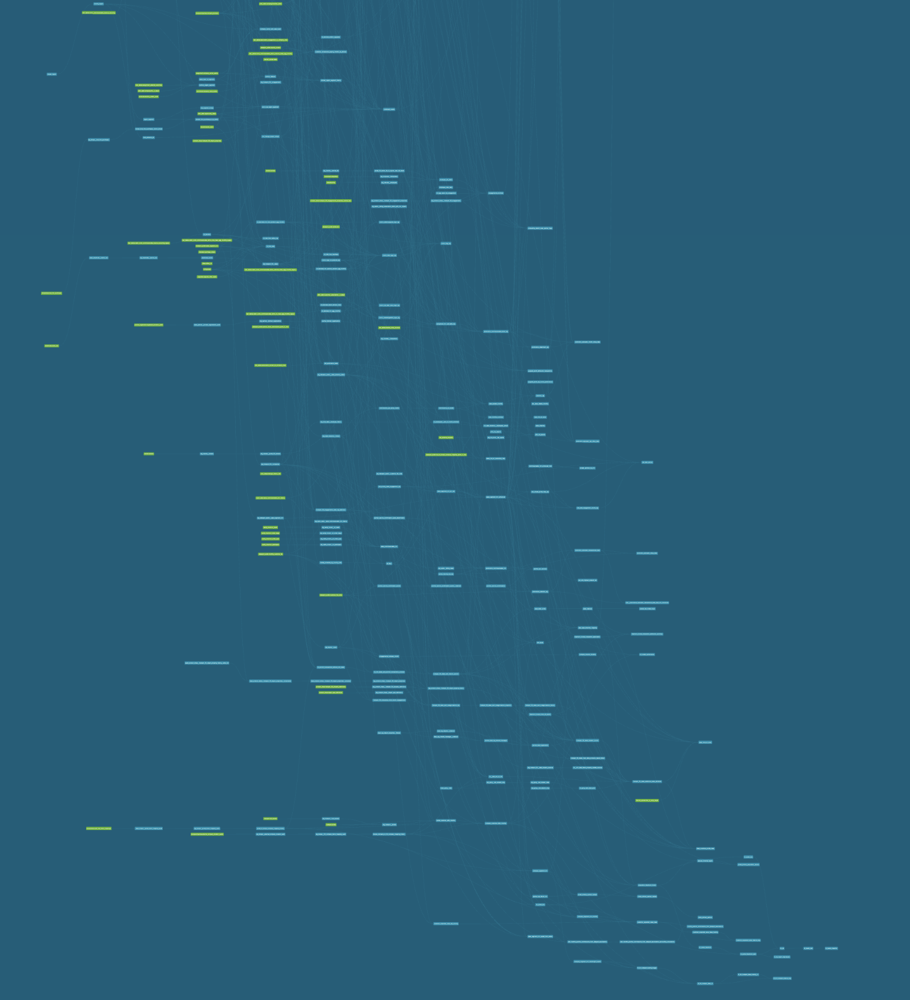
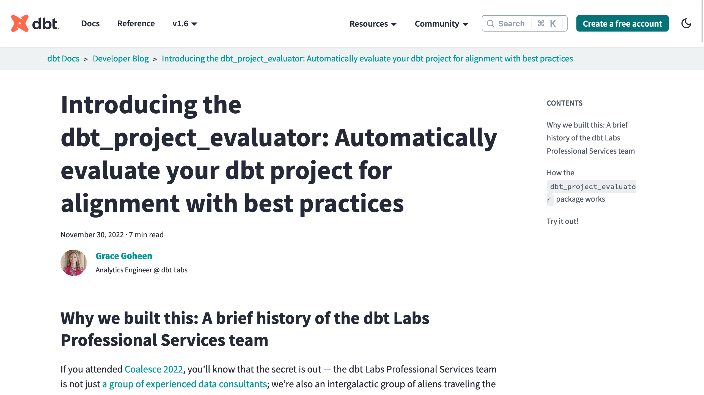
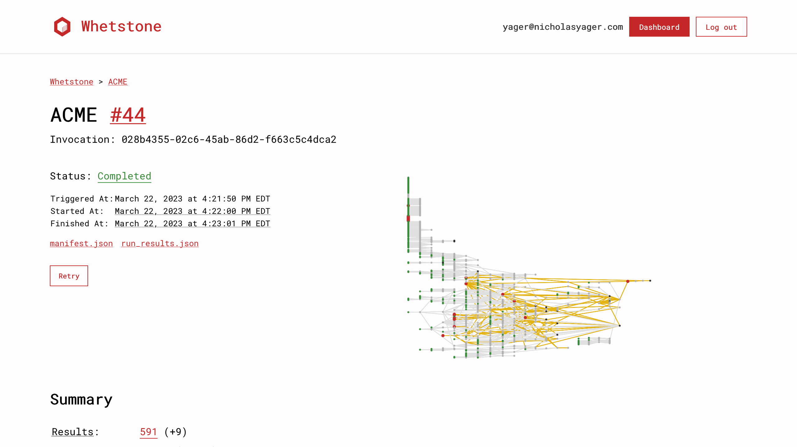
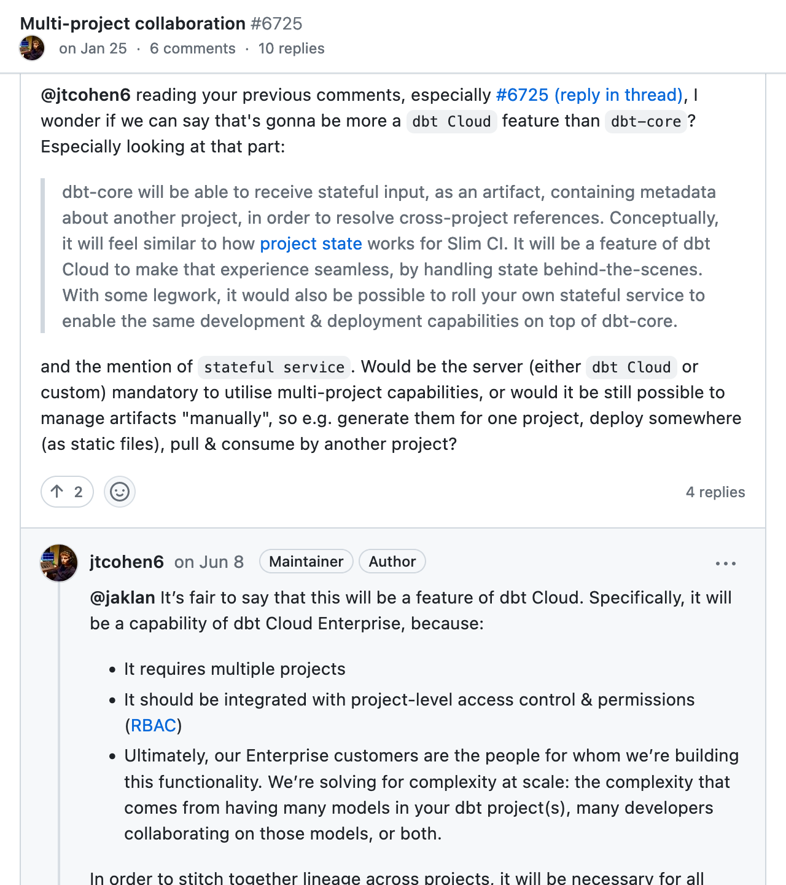
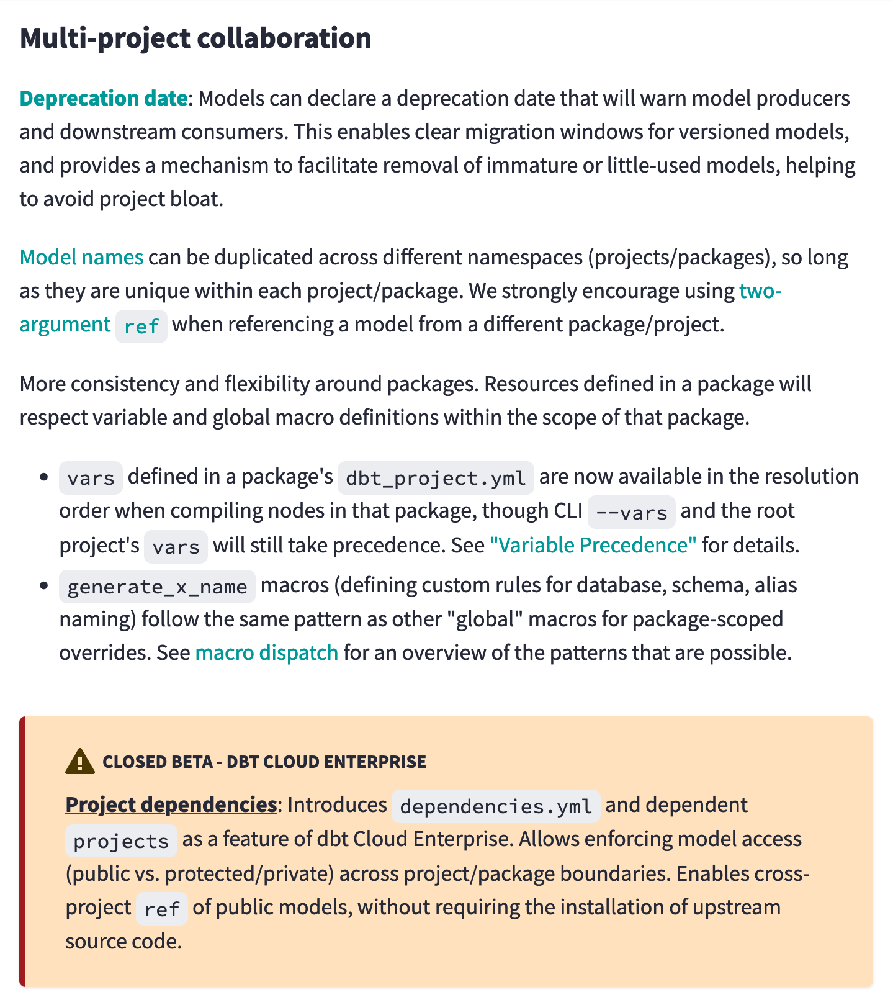
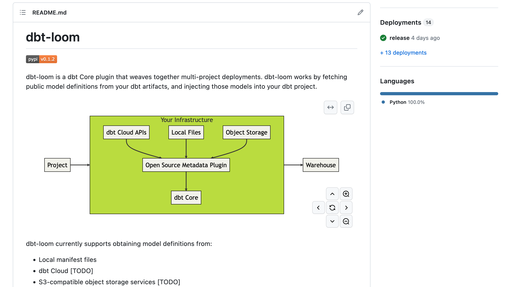

<!--
This video should be 2-5 minutes long. Your pitch does not need to be refined! Tell us the main idea behind your session, key topics that you plan to cover, and what audience members will learn. Feel free to share your screen if you want to use a doc or slides to run through your session at a high level. We recommend using Loom
--->

<!-- _class: lead -->

# From Overgrown to **Thriving**

Scaling Your dbt Project Like a Gardener

<div class="footer">
  <div class="logo">
  <video autoplay="" playsinline="" loop="" muted="" style="width: 1.5em;">
    <source src="assets/mds-wave.mp4" type="video/mp4">
  </video>
  <span>
  MDS FEST
  </span>
  </div>

  <div class="small_title">
  From Overgrown to Thriving
  </div>

  <div></div>
</div>

---

<!-- _class: left -->

<style scoped>
    small { color: gray; font-weight: thin; margin: 0; }

    section:where(.left) {
        display: flex;
        flex-flow: column nowrap;
        justify-content: center;
    }

</style>

<h1>Nicholas Yager</h1>
<small>they/them</small>
<p>
Principal Analytics Engineer
<br />
<small style="color: #D8621D;">HubSpot</small>
</p>


---


<!--
 -->

<!-- _footer: ''  -->

---



<!-- _footer: ''  -->

---

<!-- _class: lead -->

# dbt projects can be tricky to scale

<div class="footer">
  <div class="logo">
  <video autoplay="" playsinline="" loop="" muted="" style="width: 1.5em;">
    <source src="assets/mds-wave.mp4" type="video/mp4">
  </video>
  <span>
  MDS FEST
  </span>
  </div>

  <div class="small_title">
  From Overgrown to Thriving
  </div>

  <div></div>
</div>

---

# dbt projects can be tricky to scale

1. Large organizations tend toward decentralization

<!-- Suppose you're in an organization of ~ 4,000 employees. Based on dbt Lab's reporting that organizations tend to resource their data teams with 1-2% of headcount, we should expect there to be ~40 - 80 people in the data organization. If we're conservative and estimate that maybe a quarter of those people work within the organization's dbt project, we're looking at 10 - 20 full time dbt contributors. Following the two-pizza rule of team sizes, it would be reasonable to expect there to be 2 to 4 distinct operating teams working within the project. -->

---

# dbt projects can be tricky to scale

1. Large organizations tend toward decentralization
2. Decentralization can lead to inconsistent standards and significant overhead

<!--
Once you're in territory where there are multiple distinct teams forming, storming, norming, and performing, it's common for there to be drift in how the teams operate. This can be something as trivial as leading commas vs trailing commas. It can also, however, become something as important as the definition of a Customer. Perhaps GTM analytics defines a customer as a CRM account with subscription, whereas a finance analytics team may define a customer as a corporate entity. This definition mismatch means that these two analytics teams now have entirely incompatible customer reporting.
-->

---

# dbt projects can be tricky to scale

1. Large organizations tend toward decentralization
2. Decentralization can lead to inconsistent standards and significant overhead
3. It's so easy to add "just one more" model

<!-- And now we're in the endgame of how to resolve our differences. Do we put in the effort to have GTM align with Finance or vis versa, or do we make just a few more models that shim together bits of both to workaround the reporting difference? dbt makes it delightfully easy to reference existing models and start pulling in data from somewhere else in the project. -->

---

<!-- _class: lead -->

# This leads to **sprawl**

<div class="footer">
  <div class="logo">
  <video autoplay="" playsinline="" loop="" muted="" style="width: 1.5em;">
    <source src="assets/mds-wave.mp4" type="video/mp4">
  </video>
  <span>
  MDS FEST
  </span>
  </div>

  <div class="small_title">
  From Overgrown to Thriving
  </div>

  <div></div>
</div>

---


---


---

# Step One: Survey your garden

<!-- _class: lead -->

<div class="footer">
  <div class="logo">
  <video autoplay="" playsinline="" loop="" muted="" style="width: 1.5em;">
    <source src="assets/mds-wave.mp4" type="video/mp4">
  </video>
  <span>
  MDS FEST
  </span>
  </div>

  <div class="small_title">
  From Overgrown to Thriving
  </div>

  <div></div>
</div>

---

# Survey your garden

1. What are your core entities?
2. What are your exposures?
3. How are your data consumers using your models?
4. Are there any obvious architectural issues?

<div class="footer">
  <div class="logo">
  <video autoplay="" playsinline="" loop="" muted="" style="width: 1.5em;">
    <source src="assets/mds-wave.mp4" type="video/mp4">
  </video>
  <span>
  MDS FEST
  </span>
  </div>

  <div class="small_title">
  From Overgrown to Thriving
  </div>

  <div></div>
</div>

---

<!-- _class: lead -->

# Step Two: Clear out the weeds and trash

<div class="footer">
  <div class="logo">
  <video autoplay="" playsinline="" loop="" muted="" style="width: 1.5em;">
    <source src="assets/mds-wave.mp4" type="video/mp4">
  </video>
  <span>
  MDS FEST
  </span>
  </div>

  <div class="small_title">
  From Overgrown to Thriving
  </div>

  <div></div>
</div>

<!--
1. Remove deprecated or otherwise unused models
2. Consolidate duplicate models -->

---

<!-- _footer: ''  -->


---

<!-- _class: lead -->

# Step Three: Renewal pruning

<div class="footer">
  <div class="logo">
  <video autoplay="" playsinline="" loop="" muted="" style="width: 1.5em;">
    <source src="assets/mds-wave.mp4" type="video/mp4">
  </video>
  <span>
  MDS FEST
  </span>
  </div>

  <div class="small_title">
  From Overgrown to Thriving
  </div>

  <div></div>
</div>

---


<!--
Gradual removal of unproductive branches to allow a plant to spend its resources growing healthy branches.
-->
<div class="footer">
  <div class="logo">
  <video autoplay="" playsinline="" loop="" muted="" style="width: 1.5em;">
    <source src="assets/mds-wave.mp4" type="video/mp4">
  </video>
  <span>
  MDS FEST
  </span>
  </div>

  <div class="small_title">
  From Overgrown to Thriving
  </div>

  <div></div>
</div>

---


<!-- https://mermaid.live/edit#pako:eNqNVcGOmzAQ_RXL1aqX7CqwUbrl0EtzbC_tESJkzJDQGhvZZrer1f57DYZgiAPLJR7mvTdvZpDzhqnIAUe4YOKFnonU6MevhCccmYcyotQBCqREIymgomQs-rTfZk_hfoOUluIvjDEVTMghnAlUpgjr-dvt1132OPKHuOfbcMbn8PLTkciCfZEFo8QQ9xI2nEnUsnwmGlyZoihWbVgVpV8ZIPhHqppB6KO7bU_QgQ-dkd2XMGvVLaNjNdlJkvp8KRN_l2AcGxI5lfxkh6hQISTSZ-iXoo6jQl5KoLoUvNshch6LfYztbxocoyiyZx9uN-BCFzdFdmbCuBtni-rimZj1nXapNIiVPqWugWGpS6zQZYULLNsgur__Nq_r7dADDBfddwTb9KJfLw54Pt311bKD-CD4Z43-iJIPm0XmSPpJH6dF1zYdfHDT4Uc3vbxoW3Ns3VvKl54M5u4OUVk95ECYmrnuU7RRWlQgPelairyh-gGegWt11YxBtB9Sj0rTC8wxZDCNAnkr1_KNiTQdDN5IuyanED9RQi2kvlgTjaaG7uCup9N_va4f_5ymwMtrR3M6twt-NqjZGMeyHWFq4LrcHLS0kg7rrGG58o3ZrXlZozn11_F4g41wRcrc_I2-te8SbO7nChIcmWMOBWmYTnDC3w2UNFr8fuUUR1o2sMFNnZs7_lAScx1UOCpMZ_D-HyRHatc -->


<!-- https://mermaid.live/edit#pako:eNqFVU1vmzAY_iuWp2qXtAoJoymHXZbjemmPpULGvCRsxka2aVZV_e9zCB-GOoaTzfPxPn6skA9MRQ44xgUTJ3okUqPfTwlPODIPZUSpPRRIiUZSQEXJWPwtWme7TbRCSkvxF8Y9FUzIfjszqMwQ1unX64cw2476ft_pL9uZnsPp0bLIgqjIgtGi33cWl-3MopblG9Fg2xRFsRjj4qL0OwME_0hVM9i45PaxJ-zAxc5IeL_JevdW02QHSerjMOTllwSTFxF0KnOQfYVCIn0EVJG6LvnhdTTISwlUl4K3F4isp1X-iOO4XTiwyIM9GKxv3wHfe6S7EXMFQre3P7sZLuMJ7Ao2EiI_vBth4PnZ7Hrtwcte8O8aSfgjSt5W_UwqQHuiiQKtXqejFkoPPO1sve1sPMrQqwzGg29dxn7YUod-dfil1fPy5gZRWd3lQJgyMS8fjglEG6VFBdIB11LkDdV38AZc2_jAUPqQdqw0HWhWUYbTKJDXsLPehEjTPuAV2A45pbiFEmoh9RBNNJoauZpflN1O2-Q0j7unKXF4bXlOexv4s6JmNY5jW8E0wNdxc5LvSlqudQ3-yVe6W8qyJLPmL_PxChvjipS5-Sv8OL9LsPntV5Dg2CxzKEjDdIIT_mmopNHi-Z1THGvZwAo3dW6-1PuSmE9JhePCnAw-_wPVd0Sy -->


<!-- https://mermaid.live/edit#pako:eNqFVUtvnDAQ_iuWq6iXTbTsUtJwiFRpj-2lPYYIGXvYpTE2sk3SVZT_XsPyMMQLnDx8jxm-kcw7ppIBjnHO5Rs9EWXQz9-JSASyD-VE6wPkSMtaUUB5wXn8Jdpm33fRBmmj5AuMNZVcqr6cGZS2Ce_02-1DmO1HfV93-ks50wt4--VYZEGUZ8Fo0dedxaWcWVSqeCUGXJs8z1fHuLhoc-aA4B8pKw47n9z97Ak78LEzEt7vst691dTZUZHqNDR5-sEYKgutC3G0FsCZRkQwO59SQE0XqdUU4nm0YUUDFlK0a0TO0_K_xXHcHjxYtIA9WKzfgQe-H6W-puj29rHz8YknsK_5SIhGGARr2NcTDJ4OUnw16K8sBDInQAwqKwJBz0jmiDj187TrSojBQlD7xSR2C8pwURmMGex9xsvwfoTDZXX4KeDmeHODqCrvGBCu7ZiX62AC0VobWYLywJWSrKbmDl5BGBcfGNoc046VpgPNCcpyag3qGtbo7RBp2g94BXaHnFL8QgWVVGYYTdaGWrmeL8pNp01yOo8_pylxeO14TnMb-LOgZjGObVvBdIDP7eakpZW0XGcNy52vZLc2y5rM6b_OxxtsjUtSMPuDe2_eJdheBCUkOLZHBjmpuUlwIj4sldRG_jkLimOjatjgumL2f3EoiL1VShzn9svg4z-bOjw3 -->


<!-- https://mermaid.live/edit#pako:eNqVlk9vmzAYxr-KxVTtklaBJGzjsMty3C7bMVTImJeEFmxkm3ZV1e8-gyEYx4GFSzD-PY_ffwl59wjLwIu8vGSv5IS5RD9_xzSmSF2kxELsIUeCNZwAyouyjD6F6_RrEK6QkJw9w7gmrGR8WFoGlTqk7PXr9bdtuhn1w7rX66Wlp_D6y7BI_TBP_dFiWPcWemlZ1Lx4wRJMmzzPF8PQLkK-lYDgL67qEgKX3Ex7QvsuOsXbL0HaumtFp2rSI8f16XzM4QcHFbES4WNBj7qIAuWMI3mCvinicXRor6zgQGTBaNdHc0fz24P-TLaPURTpexe3G7jdPBcOXGhyFqkTSLoEEhWBPCaabDXd0znB7lZBaAmG6bHj6uhgdHTWC93ff7cz6J5ptbN2Ds1uQRM6NKFTAzSbDs7F5PiHPaOfJXpiBR3GBBVUMlQC7r-Mt86NP_TZn5-HYOCCeW4zcJv_nRv_1jEI3ALHDBy68bhmqvN39Md3FsABBguZjX2ezecqpivq2p4My90dIrx6yACXwmpOv0UaIVkF3LFdc5Y1RD7AC1ApLnqmiLbaPZUkZ8wISDGNAH5tr9WrIJJkCPDKthnkFHELOdSMy3NorJFEyYU9EWZ1-h6a8bjrNAXPjw3Pad3OvFUoq4zjsZ1gGsDlcTY015KONdowf_KV2i3FsiQzzl_mvZWnjCtcZOp_ynv7LPbUC7CC2IvUbQY5bkoZezH9UChuJPvzRokXSd7AymvqTL1E9wVWP5GVF-UqM_j4BzLN2KY -->

<!--
In a dbt project, we can prune our project by refactoring any anti-patterns currently in use in the project's core entities. This would include
-->
<div class="footer">
  <div class="logo">
  <video autoplay="" playsinline="" loop="" muted="" style="width: 1.5em;">
    <source src="assets/mds-wave.mp4" type="video/mp4">
  </video>
  <span>
  MDS FEST
  </span>
  </div>

  <div class="small_title">
  From Overgrown to Thriving
  </div>

  <div></div>
</div>

---

<!-- It's dangerous to go alone! Take these. -->



---



---

<!-- _class: lead -->

# Step Four: Divide the perennials

<div class="footer">
  <div class="logo">
  <video autoplay="" playsinline="" loop="" muted="" style="width: 1.5em;">
    <source src="assets/mds-wave.mp4" type="video/mp4">
  </video>
  <span>
  MDS FEST
  </span>
  </div>

  <div class="small_title">
  From Overgrown to Thriving
  </div>

  <div></div>
</div>

---


<!--
Dividing the perennials is the notion that we ought to separate your most industrious plants to prevent overcrowding and to allow for specialized treatment of plants in the garden.
-->

<!-- This is a picture of hostas being split up! -->

---

<!-- _class: lead -->

## Groups and Access

<div class="footer">
  <div class="logo">
  <video autoplay="" playsinline="" loop="" muted="" style="width: 1.5em;">
    <source src="assets/mds-wave.mp4" type="video/mp4">
  </video>
  <span>
  MDS FEST
  </span>
  </div>

  <div class="small_title">
  From Overgrown to Thriving
  </div>

  <div></div>
</div>

---


<div class="footer">
  <div class="logo">
  <video autoplay="" playsinline="" loop="" muted="" style="width: 1.5em;">
    <source src="assets/mds-wave.mp4" type="video/mp4">
  </video>
  <span>
  MDS FEST
  </span>
  </div>

  <div class="small_title">
  From Overgrown to Thriving
  </div>

  <div></div>
</div>

---

```yml
groups:
  - name: go_to_market
    owner:
      email: gtm@garden.supplies

  - name: customer_success
    owner:
      email: customer_success@garden.supplies
```

```yml
models:
  - name: deals
    group: go_to_market
    access: public

  - name: report_product_outcomes
    group: customer_success
    access: public
```

---


<div class="footer">
  <div class="logo">
  <video autoplay="" playsinline="" loop="" muted="" style="width: 1.5em;">
    <source src="assets/mds-wave.mp4" type="video/mp4">
  </video>
  <span>
  MDS FEST
  </span>
  </div>

  <div class="small_title">
  From Overgrown to Thriving
  </div>

  <div></div>
</div>

<!--
Just like a garden needs to be divided into separate areas for different plants, a dbt project can be modularized into smaller sections. In this section I'll discuss some basic philosophies around how to identify which models should be grouped together, how to consolidate similar models, and how to leverage groups and access controls to manage dependencies between sections.
-->

---


<div class="footer">
  <div class="logo">
  <video autoplay="" playsinline="" loop="" muted="" style="width: 1.5em;">
    <source src="assets/mds-wave.mp4" type="video/mp4">
  </video>
  <span>
  MDS FEST
  </span>
  </div>

  <div class="small_title">
  From Overgrown to Thriving
  </div>

  <div></div>
</div>

<!--
Just like a garden needs to be divided into separate areas for different plants, a dbt project can be modularized into smaller sections. In this section I'll discuss some basic philosophies around how to identify which models should be grouped together, how to consolidate similar models, and how to leverage groups and access controls to manage dependencies between sections.
-->

---

## Multi-project deployments

⚠️ Caution: Prickly practice 🌵

<!-- _class: lead -->

<div class="footer">
  <div class="logo">
  <video autoplay="" playsinline="" loop="" muted="" style="width: 1.5em;">
    <source src="assets/mds-wave.mp4" type="video/mp4">
  </video>
  <span>
  MDS FEST
  </span>
  </div>

  <div class="small_title">
  From Overgrown to Thriving
  </div>

  <div></div>
</div>

---


<div class="footer">
  <div class="logo">
  <video autoplay="" playsinline="" loop="" muted="" style="width: 1.5em;">
    <source src="assets/mds-wave.mp4" type="video/mp4">
  </video>
  <span>
  MDS FEST
  </span>
  </div>

  <div class="small_title">
  From Overgrown to Thriving
  </div>

  <div></div>
</div>

<!--
1. Teams have more flexibility and self-determination
2. Clear lines of ownership and responsibility for all models.
3. Public interfaces between projects can be versioned and contracted
 -->

---




---


<div class="footer">
  <div class="logo">
  <video autoplay="" playsinline="" loop="" muted="" style="width: 1.5em;">
    <source src="assets/mds-wave.mp4" type="video/mp4">
  </video>
  <span>
  MDS FEST
  </span>
  </div>

  <div class="small_title">
  From Overgrown to Thriving
  </div>

  <div></div>
</div>

---


<div class="footer">
  <div class="logo">
  <video autoplay="" playsinline="" loop="" muted="" style="width: 1.5em;">
    <source src="assets/mds-wave.mp4" type="video/mp4">
  </video>
  <span>
  MDS FEST
  </span>
  </div>

  <div class="small_title">
  From Overgrown to Thriving
  </div>

  <div></div>
</div>

---


<div class="footer">
  <div class="logo">
  <video autoplay="" playsinline="" loop="" muted="" style="width: 1.5em;">
    <source src="assets/mds-wave.mp4" type="video/mp4">
  </video>
  <span>
  MDS FEST
  </span>
  </div>

  <div class="small_title">
  From Overgrown to Thriving
  </div>

  <div></div>
</div>

---


<div class="footer">
  <div class="logo">
  <video autoplay="" playsinline="" loop="" muted="" style="width: 1.5em;">
    <source src="assets/mds-wave.mp4" type="video/mp4">
  </video>
  <span>
  MDS FEST
  </span>
  </div>

  <div class="small_title">
  From Overgrown to Thriving
  </div>

  <div></div>
</div>

---



---


<div class="footer">
  <div class="logo">
  <video autoplay="" playsinline="" loop="" muted="" style="width: 1.5em;">
    <source src="assets/mds-wave.mp4" type="video/mp4">
  </video>
  <span>
  MDS FEST
  </span>
  </div>

  <div class="small_title">
  From Overgrown to Thriving
  </div>

  <div></div>
</div>

<!--
1. Teams have more flexibility and self-determination
2. Clear lines of ownership and responsibility for all models.
3. Public interfaces between projects can be versioned and contracted
 -->

---

<!-- _class: lead -->

# Step Five: Keep the weeds under control

<!--
Now that we've gotten our garden into a more maintainable state state, it's
vital that we prevent weeds and other unwanted plants from taking root. In a garden
this can take a great deal of time and effort. Thankfully, this is where our
metaphor breaks down in our favor.
-->

<div class="footer">
  <div class="logo">
  <video autoplay="" playsinline="" loop="" muted="" style="width: 1.5em;">
    <source src="assets/mds-wave.mp4" type="video/mp4">
  </video>
  <span>
  MDS FEST
  </span>
  </div>

  <div class="small_title">
  From Overgrown to Thriving
  </div>

  <div></div>
</div>

---


<!-- _footer: ''  -->

---

<!-- _class: lead -->

<!--
Instead of manual effort, we can use fantastic tools to keep our garden
productive. For a while, we've had tools like pre-commit and sqlfmt to keep our
queries readable and maintainable. As of last year, we've also had developments in
architectural monitoring tools like dbt-project-evaluator and Whetstone to monitor and report on _what_ we've built as well.
-->

<h2>
Your <strong>process</strong> is more
important than your tools
</h2>

<div class="footer">
  <div class="logo">
  <video autoplay="" playsinline="" loop="" muted="" style="width: 1.5em;">
    <source src="assets/mds-wave.mp4" type="video/mp4">
  </video>
  <span>
  MDS FEST
  </span>
  </div>

  <div class="small_title">
  From Overgrown to Thriving
  </div>

  <div></div>
</div>

---

# Ways to keep the weeds under control

1. **Perform code reviews for every change, and make reviews easy!**

<div class="footer">
  <div class="logo">
  <video autoplay="" playsinline="" loop="" muted="" style="width: 1.5em;">
    <source src="assets/mds-wave.mp4" type="video/mp4">
  </video>
  <span>
  MDS FEST
  </span>
  </div>

  <div class="small_title">
  From Overgrown to Thriving
  </div>

  <div></div>
</div>

---

# Ways to keep the weeds under control

1. **Perform code reviews for every change, and make reviews easy!**
   - Show your DAG changes
   - Use CI/CD and dbt tests
   - Pick your SQL syntax and enforce it using SQL formatters.

<div class="footer">
  <div class="logo">
  <video autoplay="" playsinline="" loop="" muted="" style="width: 1.5em;">
    <source src="assets/mds-wave.mp4" type="video/mp4">
  </video>
  <span>
  MDS FEST
  </span>
  </div>

  <div class="small_title">
  From Overgrown to Thriving
  </div>

  <div></div>
</div>

---

# Ways to keep the weeds under control

1. Perform code reviews for every change, and make reviews easy!
2. **Review your project's architecture often**

<div class="footer">
  <div class="logo">
  <video autoplay="" playsinline="" loop="" muted="" style="width: 1.5em;">
    <source src="assets/mds-wave.mp4" type="video/mp4">
  </video>
  <span>
  MDS FEST
  </span>
  </div>

  <div class="small_title">
  From Overgrown to Thriving
  </div>

  <div></div>
</div>

---

# Ways to keep the weeds under control

1. Perform code reviews for every change, and make reviews easy!
2. **Review your project's architecture often**
   - Use an architecture evaluation tool like dbt_project_evaluator or Whetstone
   - Look at your DAG. Really!

<div class="footer">
  <div class="logo">
  <video autoplay="" playsinline="" loop="" muted="" style="width: 1.5em;">
    <source src="assets/mds-wave.mp4" type="video/mp4">
  </video>
  <span>
  MDS FEST
  </span>
  </div>

  <div class="small_title">
  From Overgrown to Thriving
  </div>

  <div></div>
</div>

---

# Ways to keep the weeds under control

1. Perform code reviews for every change, and make reviews easy!
2. Review your project's architecture often
3. **Periodically check to see if the execution behavior of your project has changed**

<div class="footer">
  <div class="logo">
  <video autoplay="" playsinline="" loop="" muted="" style="width: 1.5em;">
    <source src="assets/mds-wave.mp4" type="video/mp4">
  </video>
  <span>
  MDS FEST
  </span>
  </div>

  <div class="small_title">
  From Overgrown to Thriving
  </div>

  <div></div>
</div>

---

# Ways to keep the weeds under control

1. Perform code reviews for every change, and make reviews easy!
2. Review your project's architecture often
3. **Periodically check to see if the execution behavior of your project has changed**
   - Track materialization run times (dbt_artifacts or dbt Cloud) to find bottlenecks in your project
   - Leverage query usage data to identify unused models

<div class="footer">
  <div class="logo">
  <video autoplay="" playsinline="" loop="" muted="" style="width: 1.5em;">
    <source src="assets/mds-wave.mp4" type="video/mp4">
  </video>
  <span>
  MDS FEST
  </span>
  </div>

  <div class="small_title">
  From Overgrown to Thriving
  </div>

  <div></div>
</div>

---


---

<!-- _class: lead -->

# Take a short break

and then grow a bright future

<div class="footer">
  <div class="logo">
  <video autoplay="" playsinline="" loop="" muted="" style="width: 1.5em;">
    <source src="assets/mds-wave.mp4" type="video/mp4">
  </video>
  <span>
  MDS FEST
  </span>
  </div>

  <div class="small_title">
  From Overgrown to Thriving
  </div>

  <div></div>
</div>

<!--
We've come a long way! Our project now has fewer unused models, a more efficient
structure, clearly-delineated responsibilities, and automated guardrails to keep
new growth in check. We can now take a small break and enjoy our handy work.

When we're ready, we can continue to deliberately cultivate our garden with confidence and clarity.
--->

---

<!-- _class: lead -->

<video autoplay="" playsinline="" loop="" muted="" style="margin: 0 auto; width: 5em;">
    <source src="assets/mds-wave.mp4" type="video/mp4">
  </video>

Nicholas A. Yager
yager@nicholasyager.com

<div class="footer">
  <div class="logo">
  <video autoplay="" playsinline="" loop="" muted="" style="width: 1.5em;">
    <source src="assets/mds-wave.mp4" type="video/mp4">
  </video>
  <span>
  MDS FEST
  </span>
  </div>

  <div class="small_title">
  From Overgrown to Thriving
  </div>

  <div></div>
</div>
